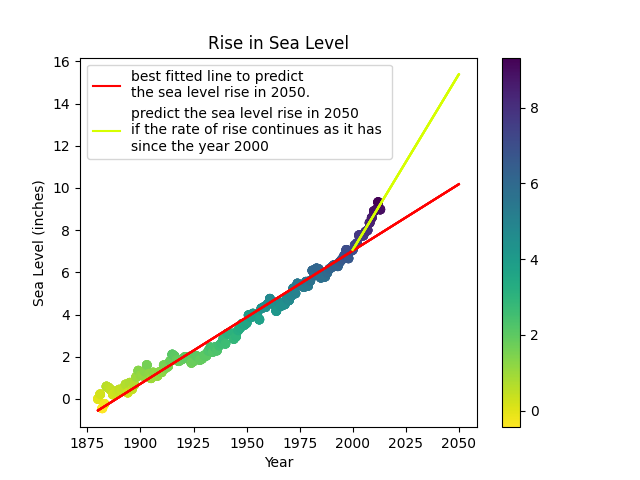

# Sea Level Predictor

This is for the Sea Level Predictor project at: https://www.freecodecamp.org/learn/data-analysis-with-python/data-analysis-with-python-projects/sea-level-predictor

## Sea level scatter plot

